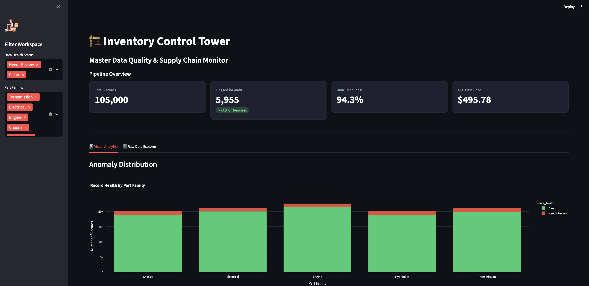

# 🏗️ Inventory Control Tower: End-to-End Supply Chain Data Pipeline
An automated, production-grade ETL (Extract, Transform, Load) pipeline designed to simulate and manage high-volume inventory data for supply chain logistics. This project demonstrates a full-stack data engineering architecture, moving from raw, messy data to an interactive Business Intelligence (BI) dashboard and future analysis. 

## 📊 Project Overview
In large-scale logistics (e.g., aviation parts, coffee distribution), data is rarely clean. This project simulates an enterprise environment where data enters the system from multiple sources with human-entry errors, pricing anomalies, and missing codes.

### Key Technical Challenges Solved:
Data Chaos Simulation: Engineered a script to generate 100,000+ records with intentional categorical inconsistencies and 100x pricing outliers.

Automated Orchestration: Utilized Mage AI to build a modular ETL pipeline that standardizes data formats and applies business logic.

Incremental Loading: Designed a "Collector" pattern that sweeps a raw directory, appends only new batches to the database, and archives source files to ensure idempotency.

Analytical Storage: Implemented DuckDB as a high-performance local OLAP engine for sub-second query speeds on the frontend.

## ⚙️ The Architecture
Extract: Python glob sweep of the /data/raw folder to ingest multiple CSV batches.

Transform: Standardized categorical strings (e.g., "ENG" → "Engine"), handled missing ELM_Codes via imputation, and flagged pricing anomalies using IQR (Interquartile Range) detection.

Load: Leveraged DuckDB's INSERT INTO logic to update the master record table.

Visualize: A Streamlit BI Dashboard provides a "Control Tower" view, allowing managers to filter for "High-Risk" records requiring manual audit.



## 🛠️ Tech Stack
Orchestrator: Mage AI (Modern Alternative to Airflow)

Database: DuckDB (In-process OLAP)

Language: Python 3.12 (Pandas, NumPy, Plotly)

Frontend: Streamlit

Environment: Virtual Environment (venv) with strict version-pinning to manage dependency conflicts.

## 🚀 How to Run
1. Setup Environment

```bash
python -m venv venv
source venv/bin/activate
pip install -r requirements.txt
```

2. Run the Pipeline (Mage AI)

```bash
mage start mage_pipeline
# Set auth to 0 for local development

export REQUIRE_USER_AUTHENTICATION=0
mage start mage_pipeline
```

Access the UI at http://localhost:6789


3. Launch the Dashboard (Streamlit)
```bash
streamlit run app.py
```

Access the dashboard at http://localhost:8501

### 📁 Project Structure

```plaintext
├── mage_pipeline/          # Mage AI project folder
├── data/
│   ├── raw/                # New batches land here
│   ├── archive/            # Processed files are moved here
│   └── processed/          # supply_chain.duckdb (Single source of truth)
├── scripts/                # Data generation and audit scripts
├── app.py                  # Streamlit application
└── requirements.txt        # Project dependencies
```

### 👨‍💻 Author
David Namgung Undergraduate in Computer Science & Statistics | McGill University High-Performance Student-Athlete & Data Enthusiast